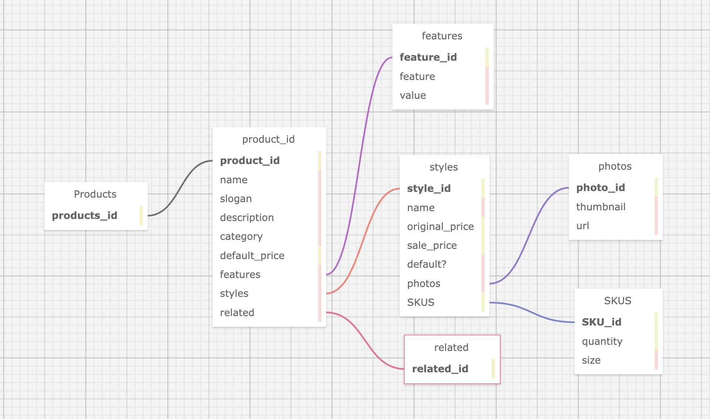

# Product Overview Server
## About
The purpose of this project was to create a back-end server and API to handle an existing front-end project.
- Used PostgreSQL functions to create responses to the front end when GET requests are received.
- Handle roughly 1000-1300 rps, tested with K6 integration.

### Database Schema

### Built With
- Node.js
- PostgreSQL
- Express
